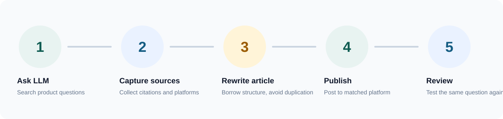
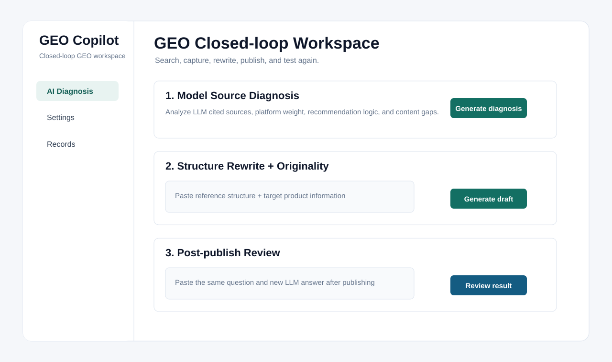

<p align="center">
  
</p>

<h1 align="center">GEO Copilot</h1>

<p align="center">
  A Chrome/Edge extension for product-focused GEO workflows: LLM source analysis, platform matching, content rewriting, and post-publish review.
</p>

<p align="center">
  <a href="PRIVACY.md">Privacy</a>
  |
  <a href="STORE_LISTING.md">Store listing draft</a>
  |
  <a href="#install-locally">Install locally</a>
  |
  <a href="#package-for-store-submission">Package</a>
</p>


## Why GEO Copilot

GEO Copilot is built around a practical GEO loop:

1. Search a product-related question in a general LLM.
2. Capture the answer, recommended products, and cited source links.
3. Open the cited platforms and learn the article structure.
4. Rewrite a publish-ready article for the matched platform.
5. Publish it, wait a few days, and test the same question again.
6. Use the review result to plan the next optimization round.



## Preview



## Features

- Capture LLM answers and source links from platforms such as DeepSeek, Qwen, Doubao, Kimi, ChatGPT, and Claude.
- Detect recommended product models, source domains, platform signals, answer structure, and content gaps.
- Capture article structures from ordinary websites, forums, blogs, industry platforms, and official pages.
- Separate LLM platforms from content platforms to avoid mixed analysis.
- Generate GEO diagnosis, platform priority, article structure, publish-ready drafts, and post-publish review conclusions.
- Rewrite reference content by borrowing structure while changing title angle, paragraph order, cases, FAQ, and parameter table.
- Store data locally in `chrome.storage.local` by default.
- Start analysis manually with `GEO START`, so each page is analyzed only when you choose.

## Dashboard

| Section | Purpose |
| --- | --- |
| AI Diagnosis | Analyze model source patterns, platform priority, content gaps, and recommended article structure. |
| GEO Rewrite | Turn reference structure and current product information into a publish-ready article. |
| Post-publish Review | Compare new LLM answers after publishing and plan the next optimization round. |
| Settings | Store long-term basics such as company/brand, industry scenario, banned claims, and API settings. |
| Records | Keep diagnosis reports, drafts, review notes, and captured data separately. |

## API Providers

The dashboard supports OpenAI-compatible `/chat/completions` APIs. Built-in presets include:

- DeepSeek
- Qwen
- Doubao / Volcengine Ark
- Kimi / Moonshot
- Zhipu GLM
- OpenAI
- Custom OpenAI-compatible endpoint

API keys are stored only in local browser extension storage.

## Install Locally

1. Open Chrome or Edge extension management.
2. Enable developer mode.
3. Choose `Load unpacked`.
4. Select this project folder.
5. Pin GEO Copilot to the toolbar.

## Package for Store Submission

Create a ZIP package with the extension files at the root:

```powershell
Compress-Archive -Path manifest.json,popup.html,dashboard.html,src,assets,README.md,PRIVACY.md,STORE_LISTING.md -DestinationPath geo-copilot-v0.1.0.zip -Force
```

Do not include `.git`, `demo`, `node_modules`, or existing `.zip` files in the store package.

## Repository Structure

```text
manifest.json
popup.html
dashboard.html
src/
assets/
docs/images/
demo/
README.md
PRIVACY.md
STORE_LISTING.md
```

## Privacy

GEO Copilot does not run a backend service. Captured page data, diagnosis reports, generated drafts, and API settings are stored locally in the browser unless you explicitly export or copy them.

When you use an external model API, prompt content is sent directly from your browser to the API endpoint you configure.

See [PRIVACY.md](PRIVACY.md) for details.

## Status

This is an MVP for validating a practical GEO workflow. Before public store release, review permissions, privacy text, screenshots, support links, and store listing copy.
