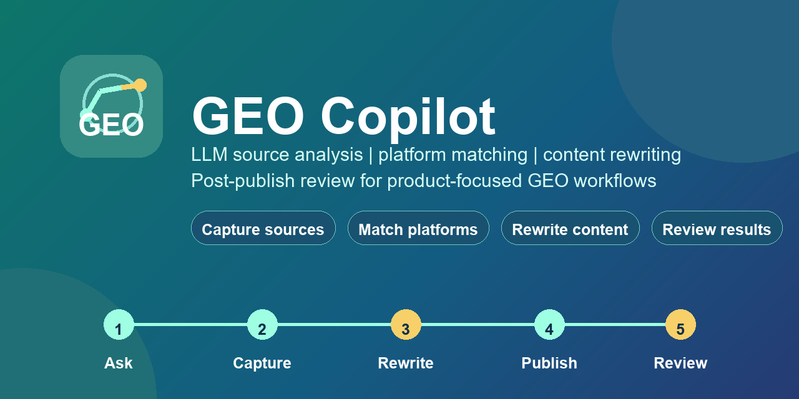

# GEO Copilot

<p align="center">
  
  
  
  
  
  
</p>

<p align="center">
  <a href="README.md">English</a> | <b>简体中文</b>
</p>

<p align="center">
  面向产品化 GEO 工作流的 Chrome/Edge 扩展：LLM 源分析、平台匹配、内容改写、发布后复盘。
</p>

<p align="center">
  <a href="PRIVACY.md">隐私说明</a>
  |
  <a href="#本地安装">本地安装</a>
  |
  <a href="#商店上架打包">打包上架</a>
</p>



## 为什么做 GEO Copilot

GEO Copilot 围绕一个可落地的 GEO 闭环构建：

1. 在通用大模型里搜索一个与产品相关的问题。
2. 捕获回答、被推荐的产品，以及被引用的源链接。
3. 打开被推荐的平台，学习其文章结构。
4. 针对匹配到的平台，改写出一篇可直接发布的文章。
5. 发布后等待几天，用同样的问题再次测试。
6. 依据复盘结果规划下一轮优化。

## 预览

完整工作流聚焦于同一个可复用的循环：提问、捕获、改写、发布、复盘。

## 功能特性

- 从 DeepSeek、Qwen、豆包、Kimi、ChatGPT、Claude 等平台捕获 LLM 回答与源链接。
- 识别被推荐的产品型号、来源域名、平台信号、回答结构与内容缺口。
- 从普通网站、论坛、博客、行业平台与官方页面捕获文章结构。
- 区分 LLM 平台与内容平台，避免混合分析。
- 生成 GEO 诊断、平台优先级、文章结构、可发布草稿与发布后复盘结论。
- 改写参考内容：借用结构，同时更换标题角度、段落顺序、案例、FAQ 与参数表。
- 数据默认存储在本地 `chrome.storage.local`。
- 用 `GEO START` 手动开始分析，只有在你选择时才分析每个页面。

## 仪表盘

| 板块 | 作用 |
| --- | --- |
| AI 诊断 | 分析模型来源规律、平台优先级、内容缺口与推荐的文章结构。 |
| GEO 改写 | 把参考结构 + 当前产品信息，变成一篇可发布的文章。 |
| 发布后复盘 | 对比发布后 LLM 的新回答，规划下一轮优化。 |
| 设置 | 存长期基础信息：公司/品牌、行业场景、禁用表述、API 设置等。 |
| 记录 | 分开保存诊断报告、草稿、复盘笔记与捕获数据。 |

## API 提供商

仪表盘支持兼容 OpenAI 的 `/chat/completions` API。内置预设包括：

- DeepSeek
- Qwen
- 豆包 / 火山方舟
- Kimi / Moonshot
- 智谱 GLM
- OpenAI
- 自定义 OpenAI 兼容端点

API 密钥只保存在本地浏览器扩展存储中。

## 本地安装

1. 打开 Chrome 或 Edge 的扩展管理页。
2. 开启「开发者模式」。
3. 选择「加载已解压的扩展程序」。
4. 选中本项目文件夹。
5. 将 GEO Copilot 固定到工具栏。

## 商店上架打包

把扩展文件放在根目录，创建一个 ZIP 包：

```powershell
Compress-Archive -Path manifest.json,popup.html,dashboard.html,src,assets,README.md,PRIVACY.md,STORE_LISTING.md -DestinationPath geo-copilot-v0.1.0.zip -Force
```

商店包内不要包含 `.git`、`demo`、`node_modules` 或已有的 `.zip` 文件。

## 仓库结构

```text
manifest.json
popup.html
dashboard.html
src/
assets/
docs/images/
demo/
README.md
PRIVACY.md
STORE_LISTING.md
```

## 隐私

GEO Copilot 不运行后端服务。捕获的页面数据、诊断报告、生成的草稿与 API 设置默认都保存在浏览器本地，除非你主动导出或复制。

当你使用外部模型 API 时，提示词内容会直接从浏览器发送到你配置的 API 端点。

详见 [PRIVACY.md](PRIVACY.md)。

## 状态

这是一个用于验证实际 GEO 工作流的 MVP。公开上架前，请复核权限、隐私文案、截图、支持链接与商店 listing 文案。

---

## 关于作者

<p align="center">
  
</p>

<p align="center"><b>🐉 AICDragon</b> — AI 工具实测与落地实践</p>
<p align="center">开源 AI Agent 自动化 · 本地大模型 · 实操教程</p>
<p align="center">每周深度拆解 AI 实战。全平台搜索 <b>AICDragon</b> 即可找到我。</p>
